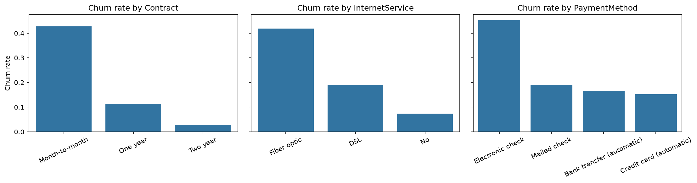
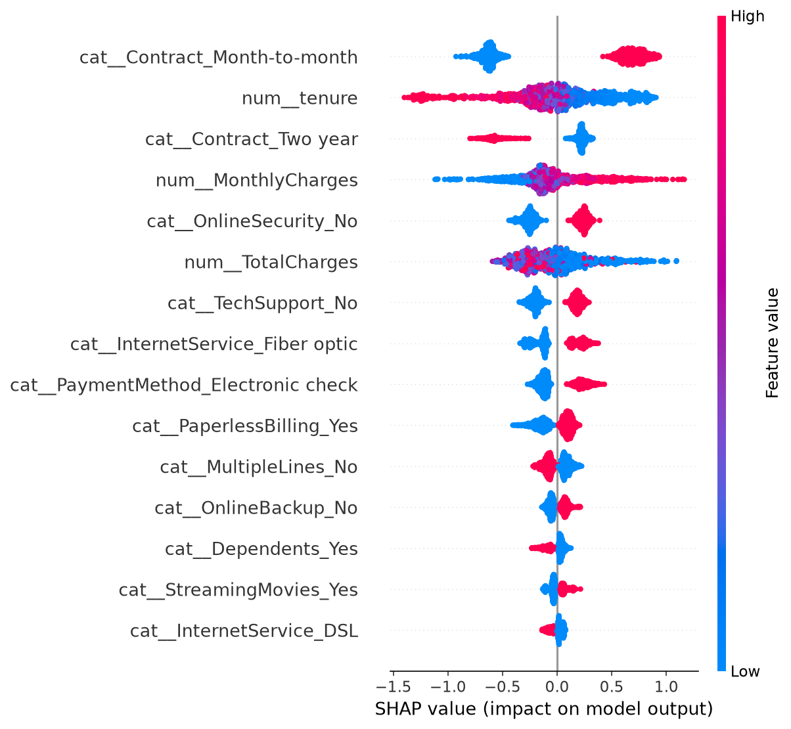

# Telco Customer Churn Prediction

Predicting which telecom customers are likely to leave, and choosing a decision threshold based on business cost rather than a default 0.5.

**Stack:** Python, pandas, scikit-learn, LightGBM, SHAP, Streamlit



## Problem
A telecom company wants to target retention offers at customers likely to churn. This is a binary classification problem on the IBM Telco Customer Churn dataset (7,043 customers, 21 columns, 26.5% churn).

## Key findings
- Churn is concentrated in month-to-month contracts (43%, versus 11% on one-year and 3% on two-year).
- Fiber optic customers churn more than DSL customers inside every contract type, so the effect is not just contract mix.
- Churners leave early: median tenure 10 months versus 38 for retained customers.
- Tenure is one of the strongest drivers: long-tenured customers are pushed away from churn, while short-tenured customers (blue points, right side) are pushed toward it, which matches the EDA (median tenure 10 months for churners vs 38 for retained customers)

## Method
1. Cleaning: `TotalCharges` had 11 blank values, all for customers with tenure 0 (not yet billed), so they were set to 0.
2. Stratified 80/20 split; all preprocessing inside a scikit-learn Pipeline to avoid leakage.
3. Metrics: ROC-AUC and PR-AUC (accuracy is misleading at 26.5% churn).
4. Models compared with 5-fold stratified CV on the training set.

## Results
| Model | CV ROC-AUC | Test ROC-AUC | Test PR-AUC |
|---|---|---|---|
| Dummy (prior) | 0.500 | – | – |
| Logistic regression | 0.846 | 0.842 | 0.634 |
| LightGBM | 0.845 | 0.846 | 0.660 |

LightGBM performs about the same as logistic regression here: the dataset is small and the signal is mostly simple. Probabilities are well calibrated (calibration curve close to the diagonal).

## Decision threshold
With illustrative assumptions (offer cost 20, retained customer value 200, 30% offer success), net gain peaks at a threshold of **0.30** and is flat between 0.25 and 0.45. These cost figures are assumptions, not company data. The threshold was selected on the test set, which makes the gain slightly optimistic; selecting it on out-of-fold training predictions would be cleaner.

## Explainability


Top drivers: month-to-month contract, tenure, two-year contract, monthly charges, lack of online security.

## Run it
```bash
pip install -r requirements.txt
streamlit run app.py
```
The notebook in `notebooks/` reproduces all results and regenerates the model.

## Limitations
- Single public dataset; no temporal split, so real-world performance over time is untested.
- Cost model uses assumed values.
- The demo approximates `TotalCharges` as tenure × monthly charges.

Data source: IBM Telco Customer Churn sample dataset.